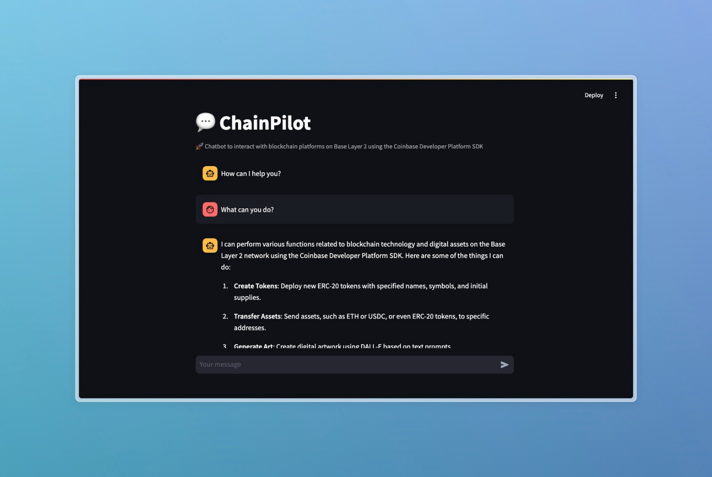
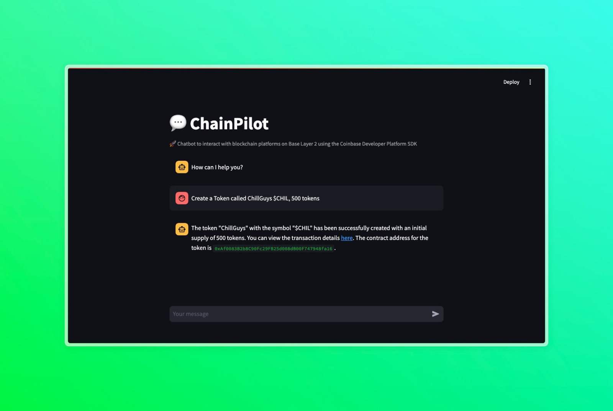

# **ChainPilot: Blockchain Interaction Agent**

## **Overview**

ChainPilot is a blockchain interaction agent that integrates blockchain functionalities with AI-based operations. Built on the Coinbase Developer Platform (CDP) SDK, ChainPilot can autonomously interact with the Ethereum Layer 2 (Base) network, perform blockchain tasks, and provide an AI-powered conversational interface via a Streamlit app.

## **Screenshots**




## **Features**

- **Blockchain Interactions**:
  - Create ERC-20 tokens
  - Transfer assets (ETH, USDC, custom tokens)
  - Deploy and mint NFTs (ERC-721)
  - Swap assets on Base Mainnet
  - Register Basenames (e.g., `.base.eth` domains)
  - Request ETH from faucet (for testnets)

- **Modes of Operation**:
  1. **Chat Mode**: Interactively run blockchain commands via CLI or Streamlit.
  2. **Autonomous Mode**: Agent performs actions automatically.
  3. **Two-Agent Mode**: AI-guided blockchain exploration with an OpenAI-powered agent.

## **Prerequisites**

Before running the program, ensure the following prerequisites are met:

- **Programming Environment**: Python 3.7+.
- **Environment Variables**:
  - `CDP_API_KEY_NAME`: Coinbase Developer Platform API key.
  - `CDP_PRIVATE_KEY`: Ethereum private key for accessing the wallet.
  - `OPENAI_API_KEY` OpenAI API key.
- **Blockchain Network**: Base Layer 2 blockchain (Mainnet or Sepolia testnet).

Here's a more concise and streamlined version of the installation instructions:

## **Installation**

### **Step 1: Clone the Repository**
```bash
git clone https://github.com/yourusername/ChainPilot.git
cd ChainPilot
```

### **Step 2: Set Up Virtual Environment & Dependencies**
```bash
python -m venv .venv
source .venv/bin/activate  # On Windows, use `.venv\Scripts\activate`
pip install -r requirements.txt
```

### **Step 3: Configure API Keys**
Create a `.env` file in the root directory with the following keys:
```plaintext
CDP_API_KEY_NAME=your_coinbase_api_key
CDP_PRIVATE_KEY=your_ethereum_private_key
OPENAI_API_KEY=your_openai_api_key
```

### **Obtaining API Keys**

#### Coinbase Developer Platform
1. Visit [Coinbase Developer Platform](https://developer.coinbase.com)
2. Create an account and generate an API key
3. Copy the API key and secret key for the `.env` file

#### OpenAI API
1. Go to [OpenAI's API platform](https://platform.openai.com/signup)
2. Create an account or log in
3. Navigate to **API Keys**
4. Click **Create new secret key**
5. Copy the generated API key to your `.env` file

**Note**: Protect your API keys and never share them publicly.

---

## **How to Run the Program**

### **1. Running via Streamlit**

To launch the Streamlit app and interact with ChainPilot through a web-based interface:
```bash
streamlit run ChatPilot_LLM_Agent.py
```

This will start the web app where you can interact with the agent in a conversational manner.

### **2. Running via CLI**

To interact with ChainPilot through the command line, execute the following:
```bash
python run.py
```

#### **Mode Selection**
- **Chat Mode**: Enter commands interactively in the terminal to perform blockchain operations.
- **Autonomous Mode**: The agent performs tasks autonomously based on predefined actions.
- **Two-Agent Mode**: Engage in a conversation between the ChainPilot agent and an OpenAI-powered assistant.

---

## **Functionalities**

ChainPilot supports multiple blockchain-related functions through CLI and Streamlit modes:

### **1. Wallet Management**
- **Agent Wallet Creation**: Automatically creates a wallet and funds it via a faucet request.
- **Faucet Requests**: Requests ETH from the testnet faucet to fund the wallet.
- **Balance Inquiry**: Retrieves balances for assets like ETH, USDC, or custom tokens.

### **2. Token and NFT Operations**
- **Create ERC-20 Token**: Deploys a custom ERC-20 token.
- **Transfer Assets**: Sends ETH, USDC, or custom tokens to a recipient wallet.
- **Deploy ERC-721 NFT**: Deploys a custom NFT collection.
- **Mint NFTs**: Mints individual NFTs within the deployed collection.

### **3. Asset Swapping**
- Swap assets (e.g., ETH for USDC) on the Base Mainnet.

### **4. Basename Registration**
- Registers a `.base.eth` or `.basetest.eth` name for the agent’s wallet using Base Layer 2's registrar contracts.

### **5. Art Generation (Streamlit)**
- Uses OpenAI's DALL-E to generate artwork based on text prompts.

### **6. Research Assistance (Streamlit)**
- Utilizes DuckDuckGo for blockchain and market research.
